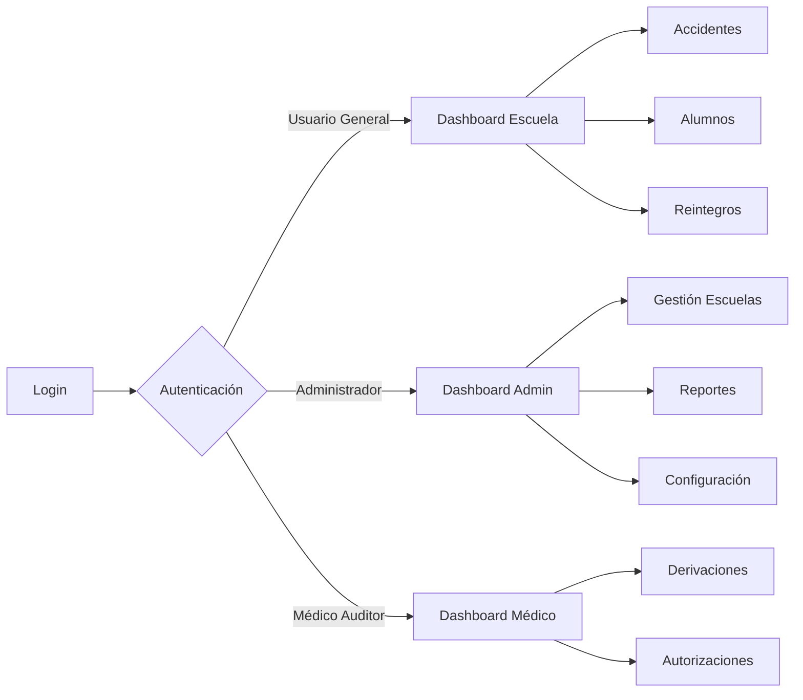
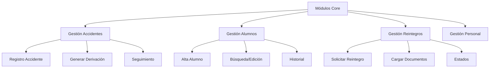
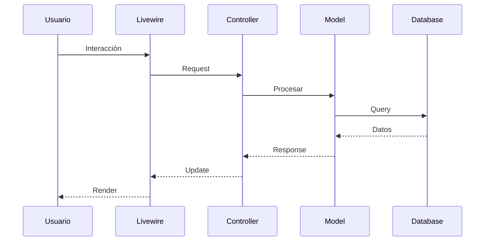
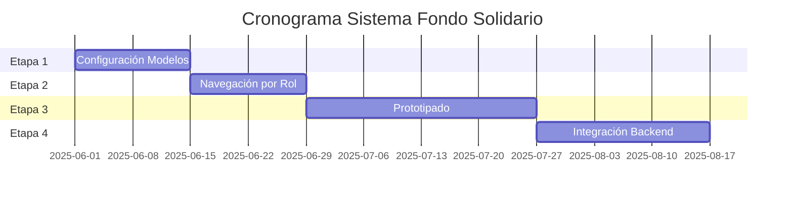

# 📋 PLAN DE DESARROLLO - SISTEMA FONDO SOLIDARIO JAEC

## 🔍 **ANÁLISIS DEL ESTADO ACTUAL**

**Stack Tecnológico Identificado:**
- **Backend**: Laravel 11.x + PHP 8.1+
- **Frontend**: HTML + Tailwind CSS (CDN) + JavaScript Vanilla
- **Base de Datos**: MySQL (fondo_solidario_jaec)
- **Componentes**: Livewire 3.x (instalado pero no implementado aún)
- **Build Tools**: Vite + NPM

**Estado Actual (Actualizado 31/05/2025):**
- ✅ Login y Dashboard funcional con Livewire
- ✅ Estructura base de Laravel configurada
- ✅ AuthController básico implementado
- ✅ Base de datos ya creada y configurada
- ✅ **Modelos definidos**: User, Role con relaciones
- ✅ **Componentes Livewire implementados**: AdminDashboard, MedicoDashboard, EscuelaDashboard
- ✅ **Diferenciación completa por roles**: 3 dashboards específicos
- ✅ **Sistema de navegación dinámica**: Menús por rol
- ✅ **Middleware de autorización**: CheckUserRole implementado
- ✅ **Sistema de auditoría**: AuditoriaService y AuditoriaMiddleware
- ✅ **Header dinámico**: Roles desde base de datos, sin configuración

---

## 🚀 **PLAN DE DESARROLLO EN 4 ETAPAS**

### **ETAPA 1: CONFIGURACIÓN DE MODELOS** (1-2 semanas)

#### Objetivos:
- Crear modelos basados en la base de datos existente
- Establecer relaciones Eloquent
- Configurar sistema de autenticación real
- Implementar seeders para datos de prueba (opcional)

#### Tareas Específicas:

```mermaid
graph TD
    A[Inicio Etapa 1] --> B[Analizar BD Existente]
    B --> C[Crear Modelos]
    C --> C1[usuarios - roles - permisos]
    C --> C2[escuelas - alumnos - personal]
    C --> C3[accidentes - derivaciones]
    C --> C4[reintegros - documentos]
    C --> C5[notificaciones - logs]
    
    C1 & C2 & C3 & C4 & C5 --> D[Definir Relaciones]
    D --> E[Crear Factories (opcional)]
    E --> F[Crear Seeders (opcional)]
    F --> G[Testing Conectividad BD]
```

#### Entregables:
1. **19 Modelos** con relaciones Eloquent definidas basados en BD existente
2. **Sistema de Roles** configurado para trabajar con tablas existentes
3. **Configuración de BD** ajustada para conectar con esquema existente
4. **Seeders opcionales** con datos de prueba realistas
5. **Documentación** de mapeo entre BD y modelos

---

### **ETAPA 2: NAVEGACIÓN INICIAL POR ROL** ✅ **COMPLETADA**

#### Objetivos:
- ✅ Implementar autenticación funcional
- ✅ Crear dashboards diferenciados por rol
- ✅ Establecer middleware de autorización
- ✅ Crear navegación dinámica según permisos

#### Arquitectura de Navegación:



#### Tareas Completadas:
1. ✅ Migrar login.html a Blade con Livewire
2. ✅ Crear componente Livewire para autenticación
3. ✅ Implementar 3 layouts base por rol (admin, medico, escuela)
4. ✅ Crear menús dinámicos con permisos (sidebar-navigation.blade.php)
5. ✅ Implementar middleware de autorización (CheckUserRole)
6. ✅ Crear páginas base para cada módulo

#### Entregables Implementados:
- **DashboardController.php**: Detecta rol y redirecciona automáticamente
- **AdminDashboard.php**: Dashboard completo para administradores JAEC
- **MedicoDashboard.php**: Dashboard especializado para médicos auditores
- **EscuelaDashboard.php**: Dashboard específico para usuarios de escuelas
- **Modelo Role.php**: Gestión de roles desde base de datos
- **Sistema de auditoría**: Logs de accesos y operaciones
- **Header dinámico**: Roles desde tabla, sin opción configuración

---

### **ETAPA 3: PROTOTIPADO DE FUNCIONALIDADES** (3-4 semanas)

#### Objetivos:
- Crear interfaces funcionales para cada módulo
- Implementar formularios con validación
- Establecer flujos de trabajo básicos
- Crear componentes reutilizables

#### Módulos a Prototipar:



#### Componentes Livewire a Crear:
- `AccidenteForm.php` - Formulario de registro
- `AlumnoSearch.php` - Búsqueda con filtros
- `ReintegroWizard.php` - Proceso paso a paso
- `DocumentUpload.php` - Carga de archivos
- `NotificationBell.php` - Notificaciones en tiempo real

---

### **ETAPA 4: CONEXIÓN CON BACKEND** (2-3 semanas)

#### Objetivos:
- Integrar todos los componentes con la BD
- Implementar lógica de negocio compleja
- Establecer sistema de notificaciones
- Optimizar rendimiento

#### Arquitectura de Integración:



#### Tareas Finales:
1. **APIs y Services**:
   - Servicio de notificaciones
   - Servicio de archivos
   - Servicio de reportes

2. **Optimizaciones**:
   - Eager loading en consultas
   - Caché de consultas frecuentes
   - Paginación eficiente

3. **Seguridad**:
   - Validación en servidor
   - Sanitización de inputs
   - Logs de auditoría

---

## 🛠️ **MEJORES PRÁCTICAS RECOMENDADAS**

### Para Laravel + Livewire:

1. **Estructura de Carpetas**:
```
app/
├── Http/
│   ├── Livewire/
│   │   ├── Accidentes/
│   │   ├── Alumnos/
│   │   └── Reintegros/
│   └── Controllers/
├── Models/
├── Services/
└── Repositories/
```

2. **Convenciones de Código**:
- Usar Form Requests para validaciones complejas
- Implementar Repository Pattern para consultas
- Usar Events y Listeners para notificaciones
- Aplicar principios SOLID

3. **Seguridad**:
- Implementar Rate Limiting
- Usar políticas (Policies) para autorización
- Encriptar datos sensibles
- Implementar 2FA para administradores

4. **Performance**:
- Usar Laravel Horizon para colas
- Implementar Redis para caché
- Optimizar queries con índices
- Lazy loading de componentes Livewire

---

## 📊 **CRONOGRAMA ESTIMADO**



**Duración Total Estimada**: 8-10 semanas

---

## 📝 **PRÓXIMOS PASOS INMEDIATOS**

1. Analizar estructura de la base de datos existente
2. Crear modelos Laravel basados en las tablas existentes
3. Configurar conexión a BD y validar conectividad
4. Implementar relaciones Eloquent entre modelos
5. Migrar login.html a componente Livewire
6. Crear layouts diferenciados por rol

---

**Fecha de creación**: 31/05/2025  
**Versión**: 1.0  
**Estado**: Aprobado ✅